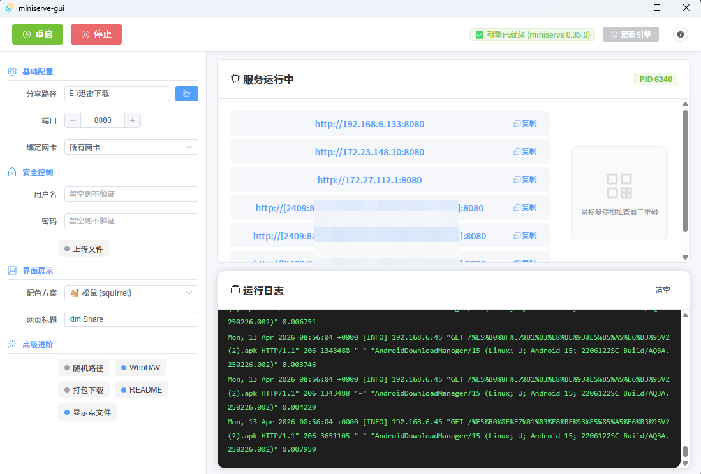

为[miniserve](https://github.com/svenstaro/miniserve) 提供图形化界面客户端。





## 功能特性

- ✅ **引擎自动管理** - 自动检测/下载最新版本的 miniserve 二进制文件
- ✅ **可视化配置** - 支持部分 miniserve CLI 参数的图形化配置
- ✅ **服务控制** - 一键启动/停止服务，实时显示服务状态
- ✅ **二维码分享** - 生成二维码，移动端扫码即访问
- ✅ **配置持久化** - 保存配置到本地，重启后自动加载
- ✅ **智能版本更新** - 根据安装环境自动选择最佳更新方案

## 下载

从 [Releases](https://github.com/ISuuuu/miniserve-gui/releases) 下载最新版本：

| 平台 | 安装版 | 便携版 (Portable) |
|------|------|------|
| **Windows** | `.exe` (NSIS 安装包) | `_portable_x64.exe` (单文件版) |
| **Linux** | `.deb` (安装包) | `.AppImage` (通用便携版) |
| **macOS** (未测试) | `.dmg` | - |

> **💡 便携版说明**：便携版无需安装，双击即可运行。适合存放在 U 盘或快速临时使用。

## 关于软件更新

为了保证系统的稳定性和安全性，不同版本采用了不同的更新策略：

- **Windows 安装版**：支持应用内**全自动下载并覆盖升级**。
- **Linux AppImage (便携版)**：支持应用内**全自动升级**（自动替换旧文件并根据新版本重命名）。
- **Windows 便携版**：点击更新后将自动跳转至 GitHub Release 页面，下载最新的单体文件手动替换。
- **Linux .deb 版本**：受系统权限限制，点击更新后会引导跳转至 Release 页面下载最新 `.deb` 包手动覆盖。

## 支持的参数

| 分类 | 参数 | 说明 |
|------|------|------|
| 基础运行 | `PATH` | 要分享的文件夹路径 |
| | `-p, --port` | 服务端口（默认 8080）|
| | `-i, --interfaces` | 绑定网卡（0.0.0.0 或 127.0.0.1）|
| 安全控制 | `-a, --auth` | 用户名:密码 认证 |
| | `-u, --upload` | 允许访客上传文件 |
| | ` -u -U` | 允许创建目录 |
| 界面展示 | `--color-scheme` | 配色主题（squirrel", "archlinux", "zenburn", "monokai）|
| | `--title` | 网页标题 |
| 高级进阶 | `-H, --hidden` | 显示隐藏文件 |
| | `--random-route ` | 随机路径 |
| | `--readme ` | 自动渲染 README |
| | `--z ` | 一键打包下载 |

## 技术栈

- **前端**: Vue 3 + TypeScript + Vite + Element Plus
- **后端**: Tauri 2 (Rust)
- **引擎**: [miniserve](https://github.com/svenstaro/miniserve)

## 开发

### 环境要求

- Node.js 20+
- pnpm 9+
- Rust 1.77+
- Windows / macOS / Linux

### 安装依赖

```bash
pnpm install
```

### 开发模式

```bash
pnpm run tauri dev
```

### 构建发布

```bash
pnpm run tauri build
```

## 配置文件位置

- **Windows**: `%LOCALAPPDATA%/miniserve-gui/bin/miniserve.exe`
- **Linux/macOS**: `~/.local/share/miniserve-gui/bin/miniserve`

配置 JSON:
- **Windows**: `%APPDATA%/miniserve-gui/config.json`
- **Linux/macOS**: `~/.config/miniserve-gui/config.json`

## 许可证

MIT
