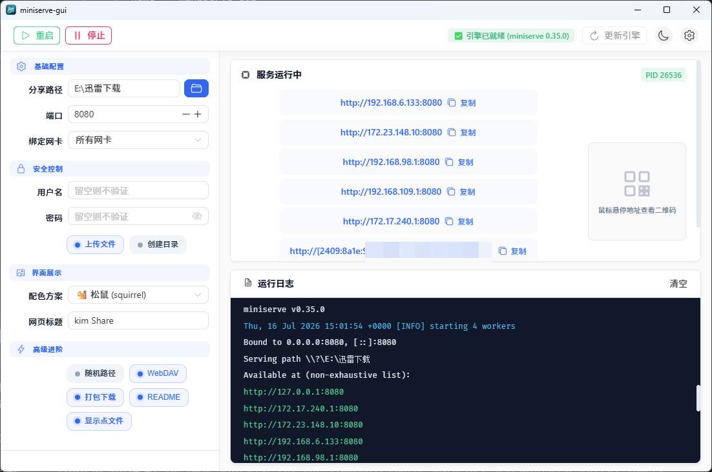

# miniserve-gui

English | [简体中文](README_zh.md)

A lightweight cross-platform desktop GUI client for [miniserve](https://github.com/svenstaro/miniserve).



## Features

- ✅ **Automatic Engine Management** - Automatically detect, download, and update the latest `miniserve` binary
- ✅ **Visual Configuration** - Configure common `miniserve` CLI options through an intuitive interface
- ✅ **One-Click Service Control** - Start, restart, or stop the HTTP file server with real-time status and logs
- ✅ **QR Code Sharing** - Instantly generate QR codes for LAN URLs so mobile devices can scan and access files
- ✅ **Persistent Configuration** - Automatically save settings locally and restore them on startup
- ✅ **Multi-Language Support** - Automatically uses English on non-Chinese locales (`LANG`/`LC_*`), with manual language switching (English / Simplified Chinese) in Settings

## Download

Download the latest release from [Releases](https://github.com/ISuuuu/miniserve-gui/releases):

| Platform    | Installer                        | Portable                              |
| ----------- | -------------------------------- | ------------------------------------- |
| **Windows** | `.exe` (NSIS Installer)          | `_portable_x64.exe` (Single Binary)   |
| **Linux**   | `.deb` / `.rpm` (System Package) | `.AppImage` (Universal Portable)      |

## Supported Options

| Category | Flag               | Description                                                |
| -------- | ------------------ | ---------------------------------------------------------- |
| Basic    | `PATH`             | Directory path to serve                                    |
|          | `-p, --port`       | Port to listen on (default `8080`)                         |
|          | `-i, --interfaces` | Interface to bind (`0.0.0.0` / `::` or `127.0.0.1`)        |
| Security | `-a, --auth`       | `username:password` HTTP authentication                    |
|          | `-u, --upload`     | Allow visitors to upload files                             |
|          | `-u -U`            | Allow creating directories                                 |
| Display  | `--color-scheme`   | Theme (`squirrel`, `archlinux`, `zenburn`, `monokai`)      |
|          | `--title`          | Custom page title                                          |
| Advanced | `-H, --hidden`     | Show hidden files (dotfiles)                               |
|          | `--random-route`   | Generate a random route suffix                             |
|          | `--readme`         | Automatically render `README.md` in directories            |
|          | `-z`               | Enable TAR/ZIP archive download for directories            |
|          | `--enable-webdav`  | Enable WebDAV protocol support                             |

## Tech Stack

- **Frontend**: Vue 3 (Composition API) + TypeScript + Vite + Naive UI + vue-i18n
- **Backend**: Tauri 2 (Rust)
- **Engine**: [miniserve](https://github.com/svenstaro/miniserve)

## Project Structure

```
├── src/                        # Frontend source
│   ├── App.vue                # Main component
│   ├── main.ts                # Vue entry point
│   ├── composables/
│   │   ├── useEngine.ts       # Engine check and download
│   │   ├── useConfig.ts       # Config persistence and auto-save
│   │   ├── useServer.ts       # Server lifecycle and status
│   │   ├── useLogs.ts         # Real-time log management
│   │   ├── useQr.ts           # QR code generation
│   │   └── useUpdater.ts      # Application auto-updater
│   ├── components/
│   │   ├── ConfigPanel.vue    # Configuration sidebar
│   │   ├── TogglePill.vue     # Feature toggle button
│   │   ├── StatusCard.vue     # Server status & QR code card
│   │   └── LogPanel.vue       # Live log viewer
│   └── i18n/
│       ├── index.ts           # i18n setup & locale detection
│       ├── zh-CN.ts           # Simplified Chinese locale
│       └── en.ts              # English locale
├── src-tauri/                  # Rust backend
│   ├── src/
│   │   ├── lib.rs             # App setup, system tray, Windows Job Object
│   │   ├── main.rs            # Binary entry point
│   │   ├── commands.rs        # Tauri IPC commands
│   │   ├── state.rs           # Application state and data structures
│   │   └── utils.rs           # Helpers, CLI argument builder, validation
│   ├── Cargo.toml
│   └── tauri.conf.json
└── package.json
```

## Development

### Prerequisites

- Node.js 20+
- pnpm 9+
- Rust 1.77+
- Windows / macOS / Linux

### Install Dependencies

```bash
pnpm install
```

### Run in Development Mode

```bash
pnpm run tauri dev
```

### Build for Production

```bash
pnpm run tauri build
```

## File Locations

Engine binary:

- **Windows**: `%LOCALAPPDATA%/miniserve-gui/bin/miniserve.exe`
- **Linux/macOS**: `~/.local/share/miniserve-gui/bin/miniserve`

Configuration JSON:

- **Windows**: `%APPDATA%/miniserve-gui/config.json`
- **Linux/macOS**: `~/.config/miniserve-gui/config.json`

## License

MIT
